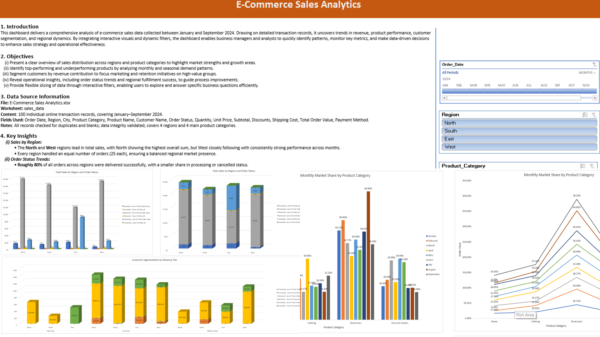

# E-Commerce Sales Analytics

## Dashboard Preview

## Project Overview

This project analyzes e-commerce sales data from January to September 2024. It transforms transaction records into an interactive Excel dashboard, revealing revenue trends, product performance, customer segments, and regional sales distribution.

## Objectives

- Summarize sales revenue by product, region, and month.
- Identify top-performing products and regions.
- Enable data-driven strategy with dynamic visuals and analysis.

## Data Source

- Sheet: `sales_data_original`
- Includes order details: date, product, quantity, price, payment, customer, city, and region.

## Key Features

- PivotTables and slicers enable real-time filtering.
- Visual trend analysis for monthly and regional sales.
- Product and customer segmentation.
- Conditional formatting highlights important metrics.

## Key Insights

- Sales peaked in June and July, showing seasonal patterns.
- Electronics and Home & Garden were top revenue categories.
- North and East regions led in total sales.
- Discount rates and shipping costs impacted profits.
- Most high-value orders used credit cards.
- Top contributing cities were quickly identified.

## Usage Instructions

1. Download and open `E-Commerce-Sales-Analytics.xlsx` in Excel.
2. Go to the `Dashboard` sheet.
3. Use slicers and filters to explore by time, region, or product.
4. Review visuals and insights to support business decisions.

## Technologies Used

- Microsoft Excel (PivotTables, slicers, conditional formatting, charts)
